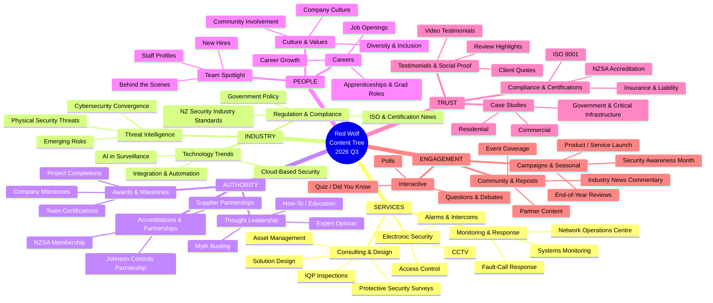

# Red Wolf Content Tree — 2026 Q3

```mermaid
mindmap
  root((Red Wolf<br/>Content Tree<br/>2026 Q3))
    SERVICES
      Electronic Security
        CCTV
        Access Control
        Alarms & Intercoms
      Monitoring & Response
        Network Operations Centre
        Systems Monitoring
        Fault-Call Response
      Consulting & Design
        Protective Security Surveys
        Solution Design
        Asset Management
        IQP Inspections
    INDUSTRY
      Threat Intelligence
        Physical Security Threats
        Cybersecurity Convergence
        Emerging Risks
      Regulation & Compliance
        NZ Security Industry Standards
        ISO & Certification News
        Government Policy
      Technology Trends
        AI in Surveillance
        Cloud-Based Security
        Integration & Automation
    AUTHORITY
      Thought Leadership
        Expert Opinion
        How-To / Education
        Myth Busting
      Accreditations & Partnerships
        NZSA Membership
        Johnson Controls Partnership
        Supplier Partnerships
      Awards & Milestones
        Company Milestones
        Team Certifications
        Project Completions
    PEOPLE
      Team Spotlight
        Staff Profiles
        Behind the Scenes
        New Hires
      Culture & Values
        Company Culture
        Community Involvement
        Diversity & Inclusion
      Careers
        Job Openings
        Career Growth
        Apprenticeships & Grad Roles
    TRUST
      Case Studies
        Commercial
        Government & Critical Infrastructure
        Residential
      Testimonials & Social Proof
        Client Quotes
        Video Testimonials
        Review Highlights
      Compliance & Certifications
        ISO 9001
        NZSA Accreditation
        Insurance & Liability
    ENGAGEMENT
      Interactive
        Polls
        Questions & Debates
        Quiz / Did You Know
      Campaigns & Seasonal
        Security Awareness Month
        End-of-Year Reviews
        Product / Service Launch
      Community & Reposts
        Industry News Commentary
        Partner Content
        Event Coverage
```
